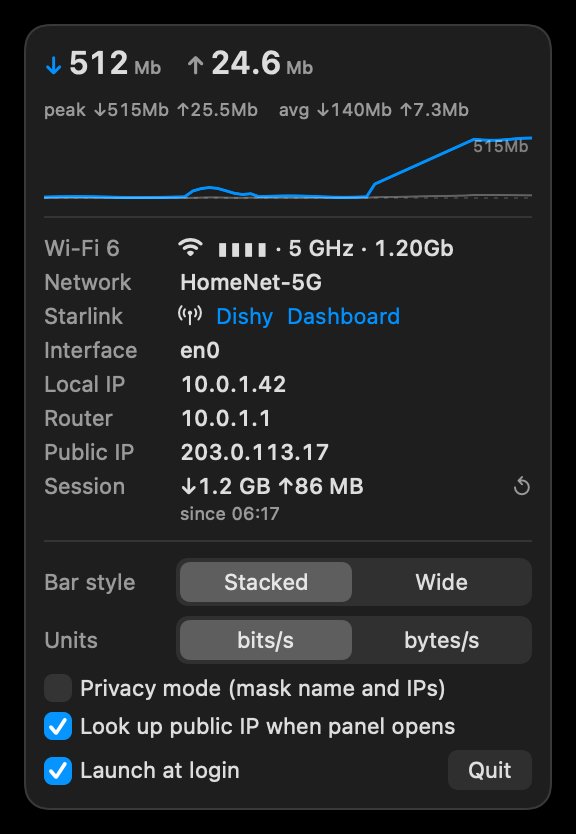
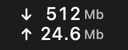
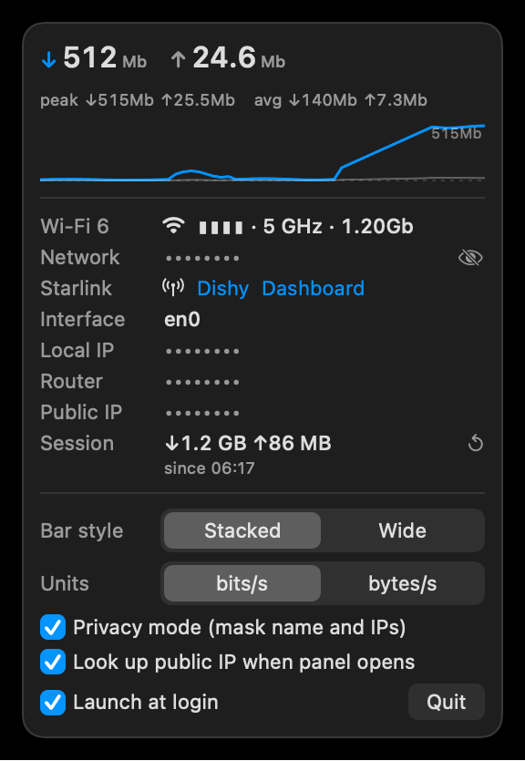

# NetBar

**A native SwiftUI menu bar network monitor for macOS.** Live download and upload speed in the
menu bar, and a click-open panel with your Wi-Fi name, interface, local IP, router, public IP,
session totals and a two-minute sparkline you can hover to inspect any moment.

It reads the kernel's own 64-bit interface counters over `sysctl` - no shell-outs, no agents,
no background network calls - and idles at about 0.18% CPU in 17 MB of memory.



*Screenshots are rendered from the app's built-in demo fixture. Every value in them is sample data
(RFC 5737 addresses, a placeholder SSID); NetBar never ships a capture of a live session.*

The menu bar item, stacked style: arrow, auto-scaled value, small unit. Quiet lines dim.



Download: [mivehchi.app/netbar](https://mivehchi.app/netbar) (free, ~120 KB zip, macOS 26+).

## What it shows

| Surface | Content |
|---|---|
| Menu bar | Stacked two-line item (`↓12.4Mb` over `↑812Kb`, about 40 px wide) by default, or a wide one-line `↓12.4Mb ↑812Kb` form. Values auto-scale (Kb / Mb / Gb per second, or KB / MB / GB) with the unit drawn smaller; a line under 50 Kb/s dims |
| Panel header | Current down / up, plus the two-minute peak and average; hovering the sparkline swaps in that moment's values and its age |
| Sparkline | 60 samples x 2 s = the last two minutes, down in the accent colour, up in grey, with the scale's top value labelled |
| Link row | Wi-Fi: generation (Wi-Fi 6), signal bars, band, channel and link rate. Ethernet, VPN or cellular: the kind and the negotiated link speed |
| Starlink | Appears only when a dish answers on your LAN: a **Dishy** link to the dish status page and, if you configure one, a **Dashboard** link to a page of your own |
| Rows | Network name, interface (a picker when more than one is up), local IPv4, router, public IP (fetched only while the panel is open, cached 5 min, can be switched off), session totals with a since-time and a reset button. Click any value to copy it |
| Footer | Bar style and unit pickers, privacy mode, public-IP lookup switch, launch-at-login (SMAppService), Quit |

## Privacy mode

Sharing your screen, recording a demo, or just do not want the network name on a menu you open
often? Tick **Privacy mode** in the footer: the Wi-Fi name, local IP, router and public IP render
as dots. The eye button reveals them for eight seconds. A masked row copies nothing to the
clipboard, and the **Look up public IP** switch stops the app from ever asking the internet for
your address.



## Starlink

When the panel opens, NetBar makes one TCP handshake to the dish's fixed address
(`192.168.100.1:9200`). That stays on your LAN and moves zero bytes over the satellite link. If a
dish answers, a **Starlink** row appears with a **Dishy** link to the dish's own status page and,
optionally, a **Dashboard** link to any https page you name:

```sh
defaults write com.parsa.netbar starlinkDashboardURL https://example.com
# remove it again
defaults delete com.parsa.netbar starlinkDashboardURL
```

The row is hidden on every other network. A Starlink router in bypass mode needs a static route
to `192.168.100.0/24` for the dish to be reachable at all.

## Interface picker

NetBar counts one interface, never a sum: the system's primary interface by default. When more
than one is up with an address (a VPN's `utun` next to Wi-Fi, say), the **Interface** row becomes
a menu and you can pin the one the menu bar counts. The choice persists; while a pinned interface
is down the row reads "down, using auto" and the primary interface is counted until it returns.

## Install

1. Unzip and move `NetBar.app` to your Applications folder.
2. First open: right-click the app and choose Open. NetBar is not notarized (it is a free,
   locally built tool), so macOS may also ask you to allow it under System Settings >
   Privacy & Security.
3. The Wi-Fi name needs Location access on macOS 14 and later (Apple gates the SSID behind it).
   The panel shows a Grant access link; NetBar uses the permission for nothing else.

## Build from source

No Xcode required - the CommandLineTools `swiftc` is enough:

```sh
./build.sh                       # -> build/NetBar.app (ad-hoc signed)
ditto --norsrc --noextattr --noacl build/NetBar.app ~/Applications/NetBar.app
codesign --force --sign - ~/Applications/NetBar.app
open ~/Applications/NetBar.app
```

`project.yml` is provided for machines with full Xcode (`xcodegen generate`, then build the
NetBar scheme). Deploy to a stable path: ad-hoc signatures change on every rebuild, and the
Location grant and the login item are bound to the signed bundle at its path.

## Demo mode and screenshots

```sh
NETBAR_DEMO=1 build/NetBar.app/Contents/MacOS/NetBar
```

runs the app on the fixed sample values in `Sources/Demo/DemoFixture.swift` - nothing is
sampled, no Location prompt, no public-IP request. Add a path to render the panel headlessly
to a 2x PNG and exit, which is how `docs/panel.png` is produced:

```sh
NETBAR_DEMO=1 NETBAR_RENDER_PANEL="$PWD/docs/panel.png" build/NetBar.app/Contents/MacOS/NetBar
NETBAR_DEMO=1 NETBAR_DEMO_PRIVACY=1 NETBAR_RENDER_PANEL="$PWD/docs/panel-privacy.png" build/NetBar.app/Contents/MacOS/NetBar
NETBAR_DEMO=1 NETBAR_RENDER_LABEL="$PWD/docs/menubar.png" build/NetBar.app/Contents/MacOS/NetBar
```

Use these for any screenshot you publish. A capture of a live session carries your real
network name and addresses.

## Battery

NetBar is built to be forgotten about. Sampling runs at 2 s while traffic moves or the panel is
open, backs off to 4 s after ten quiet ticks, and to 6 s under Low Power Mode; every sleep has a
wide tolerance so macOS can coalesce the wakeup with others. Each tick is one `sysctl` call into a
reused buffer (the size probe only reruns when an interface appears or vanishes). Sub-megabit
rates are quantized to 50 Kb steps, so background chatter does not change the label, and an
unchanged label means the cached image is reused and the menu bar is not asked to relayout.
Wi-Fi radio details and the public IP are read only while the panel is open. Sampling pauses
entirely while the displays sleep.

Measured on a release build, panel closed, settled: 0.25% average CPU over 120 s and 17 MB.

## How it works

- **Counters**: `sysctl NET_RT_IFLIST2` with 64-bit `if_data64` records (32-bit `getifaddrs`
  counters wrap in about 34 s at 1 Gbps), read every 2 s.
- **One interface**: the primary interface from `SCDynamicStore`
  (`State:/Network/Global/IPv4`), or the one you pin in the picker; VPN traffic is never
  double-counted across `utun` and `en0`.
- **Adaptive cadence**: 2 s active, 4 s quiet, 6 s quiet under Low Power Mode; see Battery.
- **Sleep aware**: sampling pauses when the displays sleep and the baseline resets on wake, so
  the first tick after wake is not hours of traffic at once.
- **Menu bar cost**: the label is fixed-width (figure-space padded, monospaced digits) and only
  reassigned when its text changes; the stacked style is a cached template `NSImage`, because
  `MenuBarExtra` flattens text labels to a single line.
- **Public IP**: fetched from `api.ipify.org` only while the panel is open, never in the
  background.

Measured on a release build with the panel closed: 0.18% average CPU over 60 s (`ps -o cputime`
delta) and 17 MB (`footprint`).

## Requirements

macOS 26 or later, Apple silicon. Swift 6, SwiftUI `MenuBarExtra`, `@Observable`.

## License

[PolyForm Noncommercial 1.0.0](LICENSE) - free for personal and other noncommercial use.
Commercial use needs a license; see [COMMERCIAL.md](COMMERCIAL.md).
